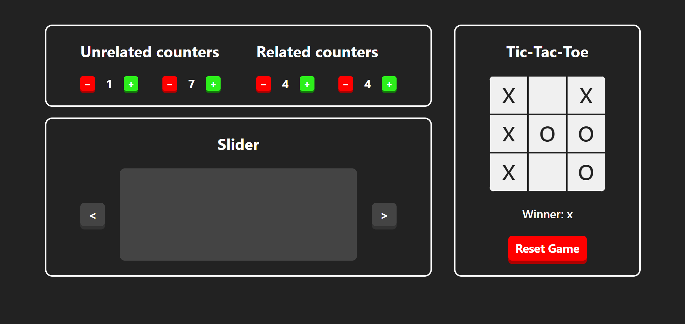

# 🚀 React Pet Projects

Сайт с моими пет-проектами, созданными в процессе изучения React.

---

## 📌 О проекте

Этот сайт — сборник небольших проектов, реализованных на React для практики работы с состоянием и логикой компонентов.

Внутри реализованы:

- 🔢 Независимые счётчики
- 🔗 Связанные счётчики
- ❌⭕ Игра «Крестики-нолики»
- 🎚 Слайдер (ещё не реализован)

---

## 🖼 Превью

[]

---

## 🛠 Технологии

- React + Vite
- JavaScript
- CSS
